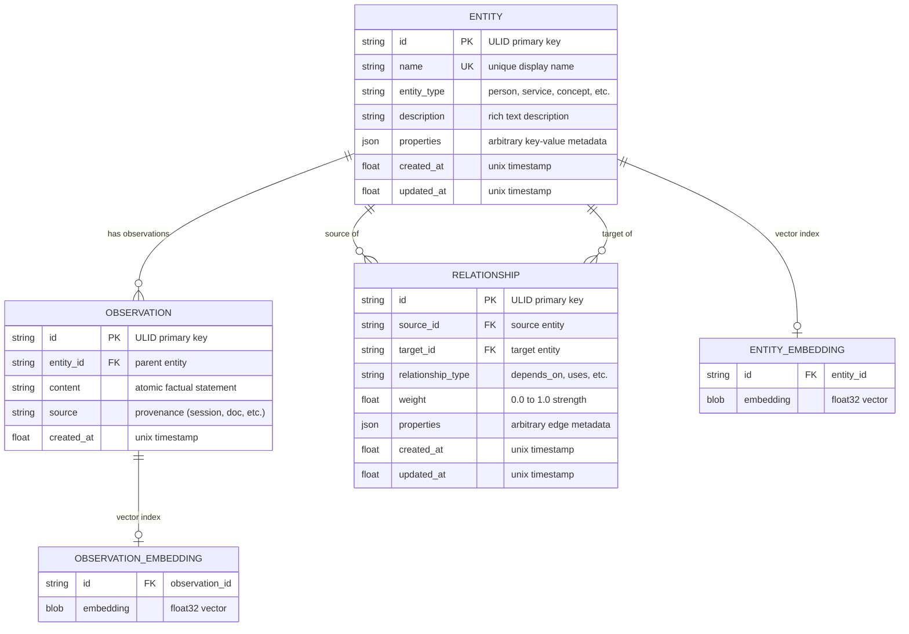
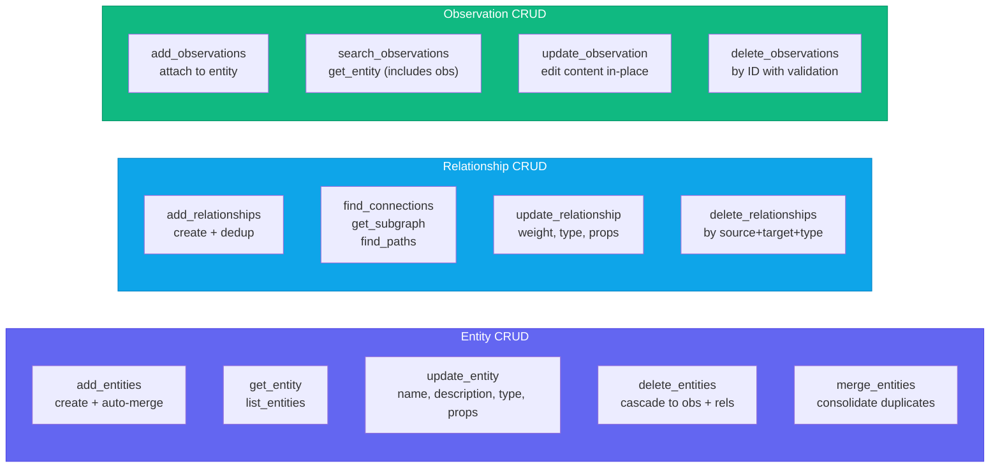
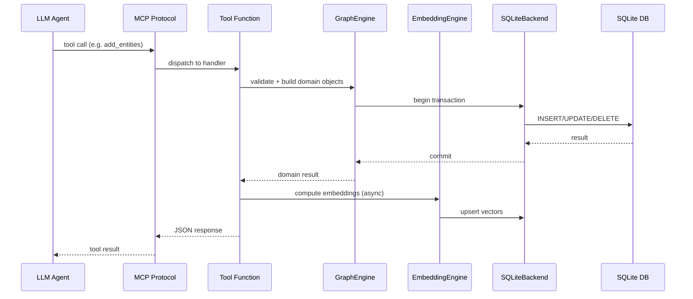
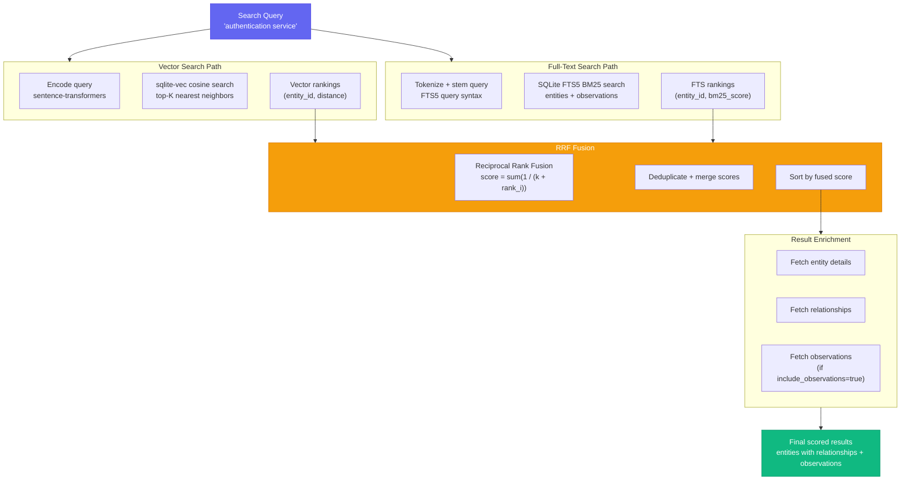
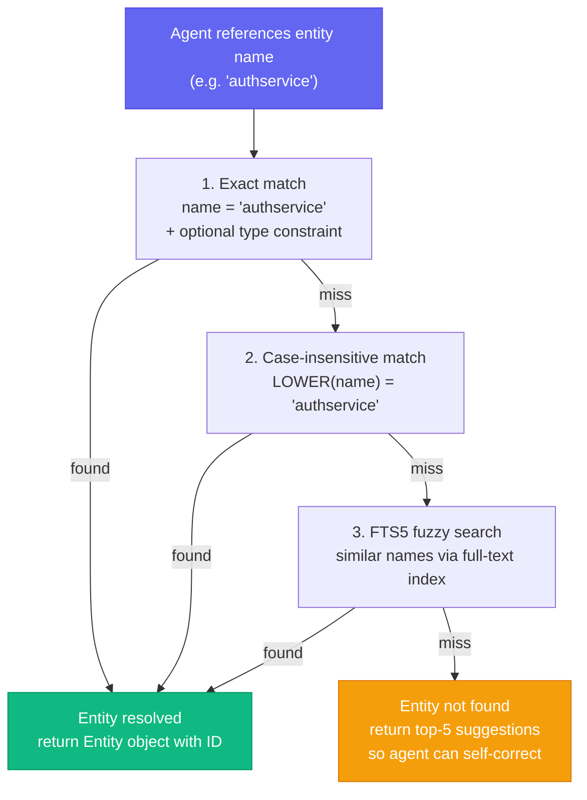
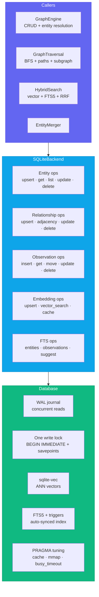
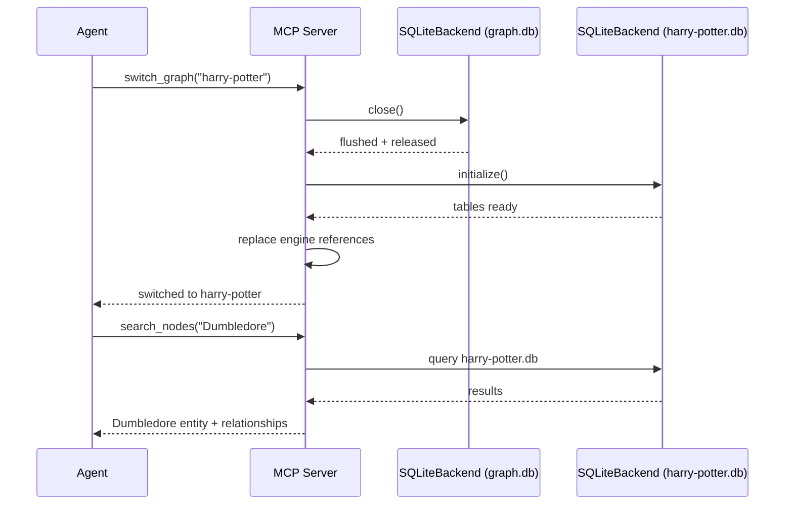
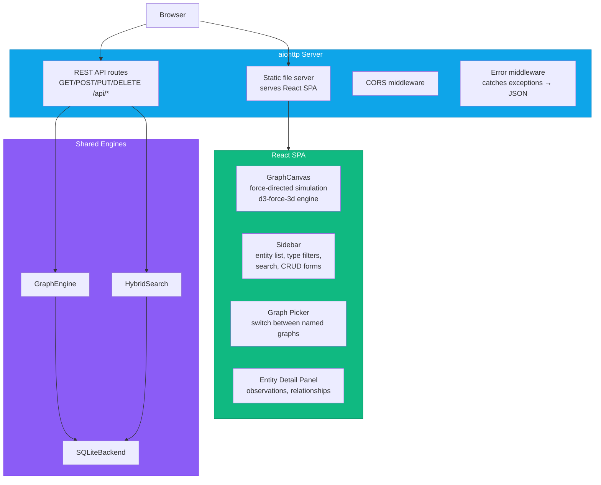

# How It Works

> Deep technical reference for graph-mem internals. For installation and usage, see the [README](README.md).

---

## Data Model

The knowledge graph has three core primitives. Every primitive supports full CRUD -- create, read, update, and delete:



- **Entities** are named nodes with a type and description (e.g., `AuthService`, type `service`).
- **Relationships** are typed, directed, weighted edges between entities (e.g., `AuthService --DEPENDS_ON--> Database`).
- **Observations** are factual statements attached to entities (e.g., "Uses bcrypt for password hashing").
- **Embeddings** are sentence-transformer vectors stored alongside entities and observations for semantic search.

---

## CRUD Operations Map



---

## Tool Request Flow

Every tool call follows the same pattern through the stack:



---

## Hybrid Search Pipeline

`search_nodes` combines three retrieval strategies using Reciprocal Rank Fusion (RRF):



1. **Vector similarity** -- cosine distance against sentence-transformer embeddings of entity names, descriptions, and observations.
2. **Full-text search** -- SQLite FTS5 with BM25 ranking for keyword matching.
3. **RRF fusion** -- merges and re-ranks results from both strategies into a single scored list.

When no embedding model is installed, search gracefully degrades to FTS-only mode.

### What the scores mean

`relevance_score` is the raw Reciprocal Rank Fusion sum: `Σ weight_i / (k + rank_i + 1)` with `k = 60`. It is **not** normalised to 0-1. A result appearing first in both the vector and full-text lists scores about `0.0164`; one appearing first in a single list scores about `0.0082`.

That matters for `min_score`. Normalising to 0-1 would force the top hit to score exactly 1.0 no matter how bad it was, which makes `min_score` a threshold against the best result rather than against relevance — it could never filter out a uniformly poor result set. Raw RRF scores are comparable across queries, so a threshold means something.

Observations contribute to their parent entity's score, capped at the value of one perfect observation match. Without the cap, ten mediocre observations outrank one exact hit.

Filters are applied when candidates are **fetched**, not afterwards. `entity_types` becomes a `WHERE` clause on the full-text query, and `entity_id` becomes one on the observation query.

This matters more than it sounds. Filtering a fixed-size candidate pool after the fact does not work: with 200 matching notes ranked above 3 matching people, a search for people looks at the top-N rows overall, finds no people among them, and returns nothing. Moving the filter into the query means the pool is drawn from matching entities to begin with.

The vector channel cannot do this — sqlite-vec performs a KNN scan with no `WHERE` clause — so when a filter is active it is given a proportionally wider pool instead.

---

## Multi-Hop Traversal

`find_connections` walks the graph breadth-first, discovering indirect relationships up to a configurable depth. This surfaces connections that no flat search can find -- like tracing a function through three layers of abstraction to the database schema it ultimately modifies.


A query like `find_connections("AuthService", max_hops=3)` traverses the full chain `AuthService -> UserStore -> PostgresDB -> users_table`, even though `users_table` never mentions "auth."

### Why the traversal is Python and not a recursive CTE

The obvious SQL formulation is a `WITH RECURSIVE` walk carrying a per-row `visited` array. It looks like breadth-first search and is not: each row's visited set is private to the path that produced it, so nothing prevents a node from being expanded again along every other route into it. The query enumerates every *simple path*, and its cost grows with the number of paths rather than with the size of the graph.

On a 14-node, 91-edge graph at `max_hops=6`, that formulation materialised **1,409,006 intermediate rows in 6.4 seconds** to return 13 entities. A breadth-first walk with one global visited set returns the same 13 entities in **1 millisecond**.

SQLite's recursive CTE cannot express a global visited set — the recursive term cannot query the rows the CTE has produced so far. So the level-stepping happens in Python: one indexed adjacency query per hop, at most ten of them, each expanding the whole current frontier at once. The work is linear in the nodes and edges actually visited.

Every traversal is bounded by a node budget (`GRAPHMEM_TRAVERSAL_NODE_BUDGET`, default 5000). A traversal that hits the budget returns what it found and sets `truncated: true` rather than silently returning a subset.

`get_subgraph` runs a single multi-source expansion from all seeds at once, not one traversal per seed.

---

## Entity Resolution

When the agent references an entity by name, graph-mem resolves it through a cascade:



1. **Exact match** -- case-sensitive name lookup, optionally scoped by entity type.
2. **Case-insensitive match** -- normalized comparison.
3. **FTS5 match** -- full-text search for partial or fuzzy names.
4. **Suggestions** -- if nothing matches, return the closest candidates so the agent can self-correct.

### When one name matches several entities

A name can belong to more than one entity of different types — "Mercury" the
planet and "Mercury" the project. Resolution has to pick one, and it picks the
most recently updated, deterministically.

Determinism is the point. Without an explicit ordering, which row SQLite
returned depended on the query plan, so the same name could resolve to a
different entity from one call to the next. `resolve_entity` is what
`add_observations`, `update_entity`, and `delete_entities` all resolve through,
so a shifting answer means an observation landing on the wrong entity with
nothing to indicate it happened.

An ambiguous resolution is logged with the match count and the entity chosen.
Pass `entity_type` to resolve exactly rather than relying on the tiebreak.

---

## Storage Architecture



There is one storage backend, and it is the interface. An earlier version of
this package carried a 476-line abstract base class advertising Neo4j,
Memgraph, and PostgreSQL support, plus a registry to select between them.
Neither worked, and neither could:

- `create_backend` resolved a class from the registry and then returned
  `SQLiteBackend` regardless of what it found.
- `Config` only ever accepted `"sqlite"`, so no alternative could be selected
  even if the registry had worked.
- The base class's own `fetch_all(sql)` and `fetch_one(sql)` methods took raw
  SQL strings. No graph database can implement those — and fifteen call sites
  outside the storage package already depended on exactly those two methods.

What the abstraction actually produced was a 190-line stub in the test suite
whose only purpose was to satisfy the ABC, and which had to be extended every
time a real method was added to the real backend. It was removed. Adding a
second backend is still possible; it would start by replacing the raw-SQL
escape hatches with typed operations, which is the work the base class was
pretending had already been done.

---

## Project Structure

```mermaid
graph TD
    Root["src/graph_mem/"]

    Entry["server.py + tools/<br/>MCP entry point<br/>28 tool definitions<br/>lifespan + embedding helpers"]
    CLI["cli/<br/>main.py -- Click CLI commands<br/>install.py -- skill installer, 13 agents"]
    DB["db/<br/>connection.py -- aiosqlite wrapper<br/>schema.py -- migration runner<br/>migrations/ -- versioned SQL"]
    GraphMod["graph/<br/>engine.py -- CRUD + entity resolution<br/>traversal.py -- BFS + pathfinding + subgraph<br/>merge.py -- entity consolidation"]
    Models["models/<br/>entity.py -- Entity dataclass<br/>relationship.py -- Relationship dataclass<br/>observation.py -- Observation dataclass"]
    SemanticMod["semantic/<br/>embeddings.py -- lazy model + ONNX + cache<br/>search.py -- hybrid vector+FTS5+RRF"]
    StorageMod["storage/<br/>sqlite_backend.py -- all SQL<br/>__init__.py -- backend factory"]
    UIMod["ui/<br/>server.py -- aiohttp app factory<br/>routes.py -- REST API endpoints<br/>frontend/ -- pre-built React SPA"]
    Utils["utils/<br/>config.py -- Config dataclass + env vars<br/>errors.py -- 14 error classes<br/>ids.py -- ULID generation<br/>logging.py -- structured logging"]

    Root --> Entry
    Root --> CLI
    Root --> DB
    Root --> GraphMod
    Root --> Models
    Root --> SemanticMod
    Root --> StorageMod
    Root --> UIMod
    Root --> Utils

    style Root fill:#6366f1,stroke:#4f46e5,color:#fff
    style Entry fill:#0ea5e9,stroke:#0284c7,color:#fff
```



| Module | Responsibility |
|--------|---------------|
| `server.py` + `tools/` | MCP server entry point, registers all 28 tools, lifespan management, embedding orchestration |
| `cli/` | Click CLI commands (server, init, status, export, import, validate, ui) + skill installer for 13 agents, every install path cited against vendor docs |
| `db/` | Database class (aiosqlite, WAL mode, PRAGMA tuning) + versioned migrations |
| `graph/` | GraphEngine CRUD, BFS traversal, path-finding, subgraph extraction, entity merging |
| `models/` | Dataclasses for Entity, Relationship, Observation |
| `semantic/` | EmbeddingEngine (lazy loading, ONNX, content-hash cache) + HybridSearch (vector + FTS5 + RRF) |
| `storage/` | SQLiteBackend — every SQL statement in the project lives here — plus the factory that constructs it |
| `ui/` | aiohttp web server + REST API routes + pre-built React SPA graph explorer |
| `utils/` | Config, structured logging, error hierarchy (14 classes), ULID generation |

---

## Multi-Graph Architecture

graph-mem supports multiple named graphs per project. Each graph is a fully independent SQLite database stored in the `.graphmem/` directory:

```
.graphmem/
├── graph.db           # default graph
├── harry-potter.db    # named graph: "harry-potter"
├── research.db        # named graph: "research"
└── codebase.db        # named graph: "codebase"
```

### How switching works

When an agent calls `switch_graph("harry-potter")`, the server:

1. **Resolves the path** -- `<project_dir>/.graphmem/harry-potter.db`
2. **Closes the current storage backend** -- flushes WAL, releases file handles
3. **Creates a new SQLiteBackend** pointing at the target database file
4. **Initializes** -- runs migrations, creates tables if the DB is new
5. **Hot-swaps engines** -- replaces the `GraphEngine`, `HybridSearch`, and `GraphTraversal` instances with new ones backed by the new storage
6. **Returns confirmation** -- the agent immediately sees data from the new graph

All 28 MCP tools operate on whichever graph is currently active. No tool call needs a graph parameter -- the active graph is implicit server state.



### CLI graph targeting

CLI commands accept `--graph <name>` to target a specific graph without switching the server's active graph:

```bash
graph-mem status --graph harry-potter   # stats for harry-potter.db
graph-mem export --graph research       # export research.db
graph-mem ui --graph codebase           # visualise codebase.db
```

---

## Graph Visualisation UI

The `open_dashboard` tool (and `graph-mem ui` CLI command) launches a web-based graph explorer built with aiohttp + React:



### REST API endpoints

The UI backend exposes these endpoints:

| Method | Path | Description |
|--------|------|-------------|
| `GET` | `/api/graph` | Full graph data (entities + relationships) for canvas rendering |
| `GET` | `/api/entity/:name` | Entity detail with observations and relationships |
| `POST` | `/api/entity` | Create a new entity |
| `PUT` | `/api/entity/:name` | Update entity name, description, type, or properties |
| `DELETE` | `/api/entity/:name` | Delete entity (cascades to observations + relationships) |
| `GET` | `/api/search?q=...` | Hybrid search across all entities |
| `GET` | `/api/stats` | Graph statistics (counts, distributions, most-connected) |
| `GET` | `/api/graphs` | List all named graphs with counts |
| `POST` | `/api/graphs/switch` | Switch active graph |

### Canvas rendering

The graph canvas uses a force-directed simulation powered by `d3-force-3d`:

- **Nodes** are entities, sized by connection count and colored by entity type
- **Links** are relationships, with labels showing the relationship type
- **Physics** is configurable: spring strength, repulsion, damping, gravity
- **Focus** -- clicking a node or sidebar entry smoothly animates the camera to center on it
- **Keyboard shortcuts** -- Space (reheat simulation), F (fit all nodes in view), Escape (deselect)
